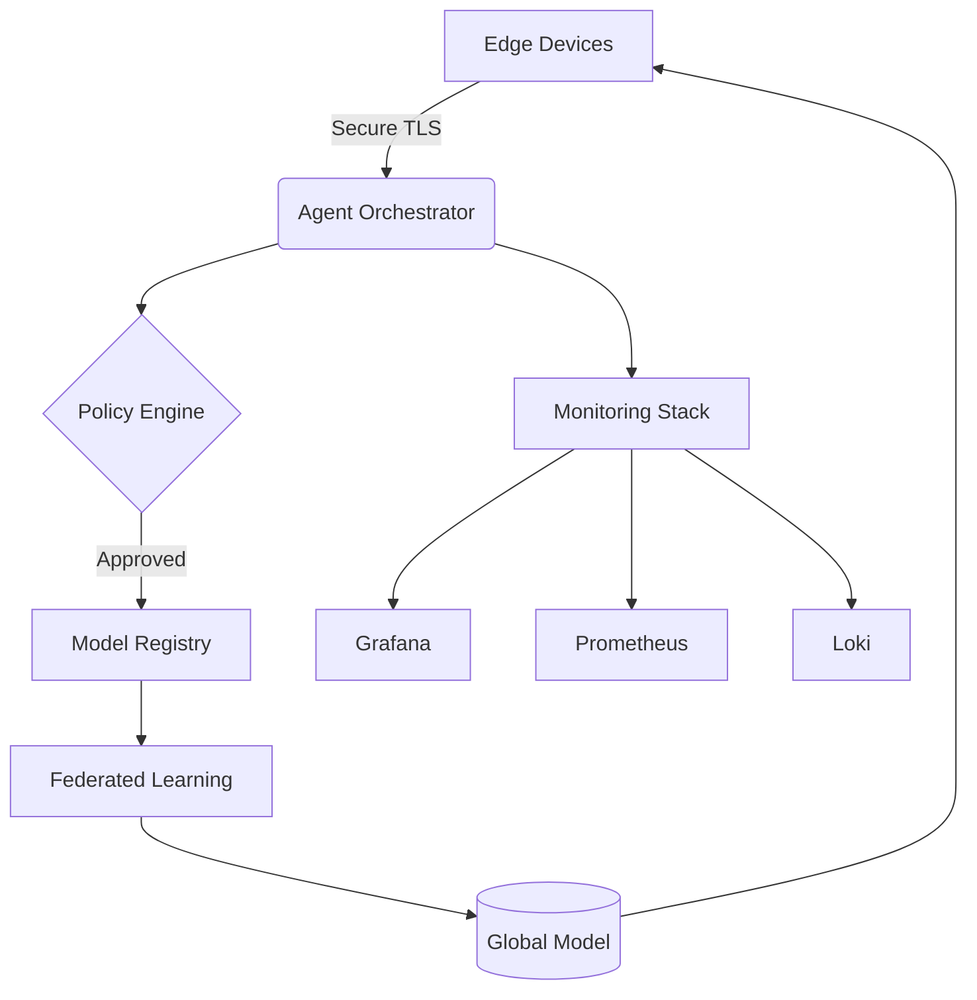
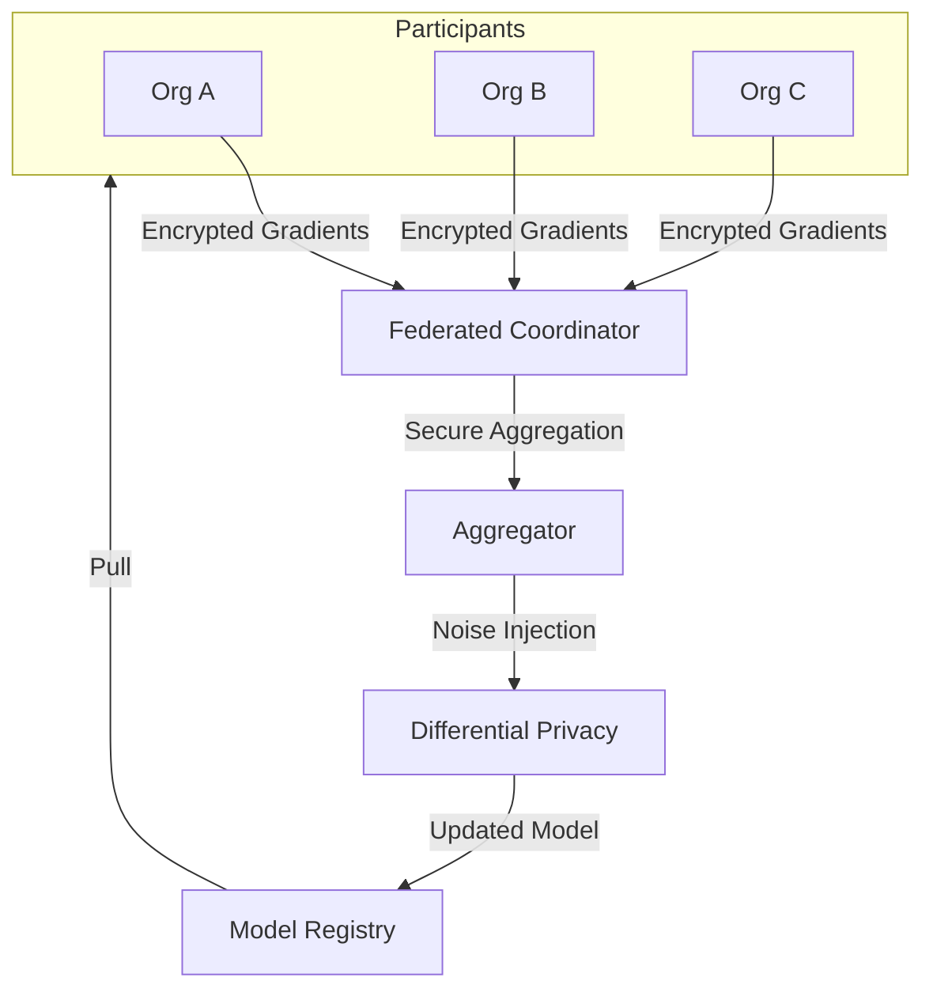

# Hadean-AI Platform

[](https://opensource.org/licenses/Apache-2.0)
[](https://www.python.org/)
[](https://github.com/your-org/hadean-ai/releases)
[](https://hub.docker.com/r/your-org/hadean-agent)
[](https://your-org.slack.com/archives/C02ABCDEFGH)

Enterprise-grade distributed intelligence platform for building and operating AI agent ecosystems at planetary scale.

[](https://twitter.com/HadeanAI)
[](https://www.linkedin.com/in/evan-cox-325928b/)
[](https://github.com/HadeanAI)


```
 __  __               __                              ______  ______     
/\ \/\ \             /\ \                            /\  _  \/\__  _\    
\ \ \_\ \     __     \_\ \     __     __      ___    \ \ \L\ \/_/\ \/    
 \ \  _  \  /'__`\   /'_` \  /'__`\ /'__`\  /' _ `\   \ \  __ \ \ \ \    
  \ \ \ \ \/\ \L\.\_/\ \L\ \/\  __//\ \L\.\_/\ \/\ \   \ \ \/\ \ \_\ \__ 
   \ \_\ \_\ \__/.\_\ \___,_\ \____\ \__/.\_\ \_\ \_\   \ \_\ \_\/\_____\
    \/_/\/_/\/__/\/_/\/__,_ /\/____/\/__/\/_/\/_/\/_/    \/_/\/_/\/_____/
```                                                                    
                                                                         
## System Architecture

### High-Level Overview


## Core Workflows
### Agent Lifecycle Management


### Federated Learning Round



## Core Capabilities

### Intelligent Agent Framework
- Multi-modal agent types (Reactive/Proactive/Adaptive)
- Lifecycle management (Spawn/Scale/Retire)
- Hybrid execution (Sync/Async/Streaming)
- Resource-aware scheduling
- Cross-agent collaboration protocols

### Federated Learning Engine
- Secure multi-party computation (SMPC)
- Differential privacy guarantees (ε=1.0, δ=1e-5)
- Heterogeneous model aggregation
- Automated compliance auditing
- Federated transfer learning

### Enterprise Features
- **Zero-Trust Architecture**
  - SPIFFE/SPIRE identity management
  - mTLS service mesh (Istio integration)
  - Confidential computing (Intel SGX/AMD SEV)
- **Observability Stack**
  - Metrics: Prometheus + OpenTelemetry
  - Logging: Loki + FluentBit
  - Tracing: Jaeger + Tempo
- **Compliance Ready**
  - GDPR Article 35 DPIA templates
  - HIPAA BAA-ready configurations
  - SOC2 Type II audit trails

## Architecture Components

### Platform Services
| Service              | Description                                  | Tech Stack           |
|----------------------|----------------------------------------------|----------------------|
| Agent Orchestrator    | Manages agent lifecycle & resource allocation| Python/Redis/gRPC    |
| Model Registry        | Version-controlled ML model storage         | MLflow/ONNX/S3       |
| Policy Engine         | Real-time governance & compliance checks     | OPA/Rego/WebAssembly |
| Federated Coordinator | Secure distributed training controller       | PySyft/HELib/Kubernetes |

### Infrastructure Layer
```text
Container Runtime: containerd 1.6+ 
Orchestration: Kubernetes 1.25+ (ARM/x86 multi-arch)
Service Mesh: Istio 1.16+ with Ambient Mesh
Storage: Rook Ceph 1.10+ for persistent volumes
Security: HashiCorp Vault 1.12+ & Boundary 0.12+
```

## Getting Started
### Local Development
### Prerequisites
```
# Install Core Tools
brew install k3d helm-cli kubectx
python3 -m pip install --user poetry==1.4.2

# Start Local Cluster
k3d cluster create hadean-dev \
  --api-port 6550 \
  --servers 1 \
  --agents 3 \
  --k3s-arg "--disable=traefik@server:0"
```

### Bootstrap Environment
```
git clone https://github.com/your-org/hadean-ai.git
cd hadean-ai

# Install Dependencies
poetry install --with dev

# Deploy Platform
make deploy-dev ENV=local

# Verify Installation
curl -s http://localhost:8000/health | jq
# Expected: {"status": "SERVING", "components": ["database", "cache", "model-registry"]}
```

### Production Deployment
```
global:
  environment: production
  datacenter: aws-us-west-2
  
agentOrchestrator:
  replicas: 6
  resources:
    limits:
      cpu: 2
      memory: 4Gi
  autoscaling:
    enabled: true
    minReplicas: 3
    maxReplicas: 15

federatedLearning:
  enabled: true
  smpc:
    enabled: true
    threshold: 3
```

### Deployment Command
```
helm upgrade hadean-prod ./charts/hadean-platform \
  --namespace ai-production \
  --values ./charts/prod-values.yaml \
  --set global.image.tag=$(git rev-parse --short HEAD) \
  --atomic \
  --timeout 15m
```

## API Specifications
### gRPC Service Definition
```
syntax = "proto3";

service AgentService {
  rpc CreateAgent(AgentSpec) returns (AgentHandle);
  rpc ExecuteTask(stream TaskChunk) returns (stream ResultBatch);
  rpc GetTelemetry(TelemetryRequest) returns (TelemetryResponse);
}

message AgentSpec {
  string agent_type = 1;
  ComputeProfile compute = 2;
  PrivacyLevel privacy = 3;
}
```

### REST API Examples
### Start Federated Round
```
curl -X POST https://api.hadean.ai/v1/federated/rounds \
  -H "Authorization: Bearer $HA_TOKEN" \
  -H "Content-Type: application/json" \
  -d '{
    "strategy": "fedavg",
    "participants": ["org-a", "org-b"],
    "model_uri": "s3://models/resnet50-v3.onnx"
  }'
```

## Operational Excellence
### Key Metrics
```
# Agent Density
sum(irate(agent_actions_total[5m])) by (namespace)

# Federated Learning Progress
federated_round_duration_seconds{quantile="0.99"}

# Privacy Budget Consumption
delta_privacy_epsilon{method="tree_aggregation"}
```

### Disaster Recovery
### Backup Configuration
```
apiVersion: velero.io/v1
kind: Schedule
metadata:
  name: hadean-daily
spec:
  schedule: "@every 24h"
  template:
    ttl: 720h
    includedNamespaces: ["hadean-prod"]
    storageLocation: "aws-s3-west"
```

## Security Model

### Defense-in-Depth Layers
1. Identity
- SPIFFE Verifiable Identity Documents
- JWT-based service-to-service auth

2. Network
- Calico Network Policies
- WireGuard encrypted overlays

3. Data
- AES-256-GCM at rest encryption
- Column-level TDE for PII fields

4. Compute
- Enclave-shielded execution
- eBPF-based runtime protection
